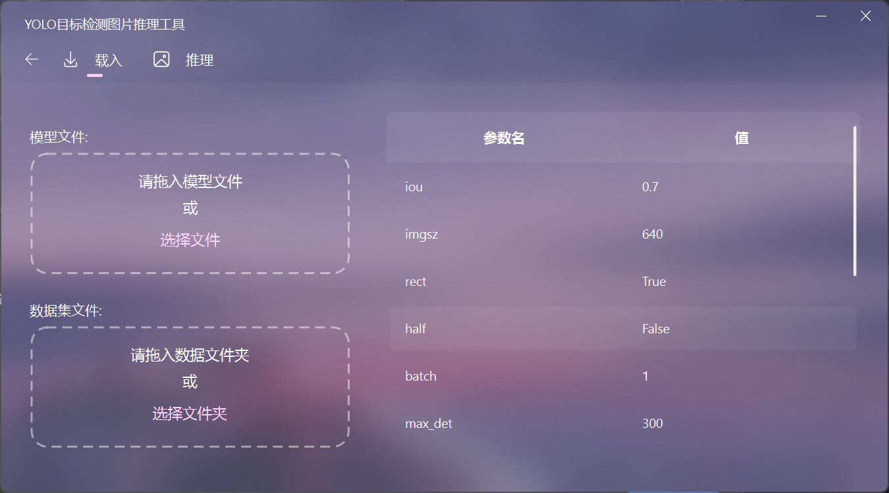
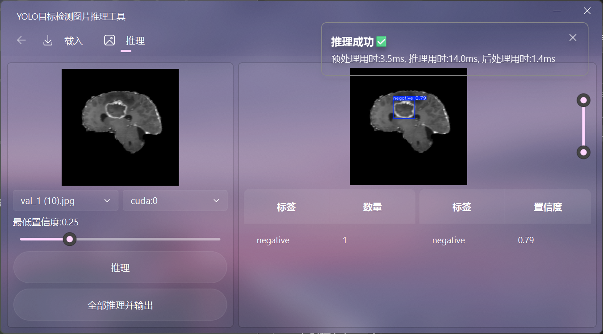

# YOLO 目标检测训练与推理工具

这个仓库分成两部分：

1. 训练部分：用于在启智社区 / OpenI 的线上训练环境里训练 YOLO 模型，脚本会自动通过 C2Net 上下文获取数据集和预训练权重，并在训练结束后回传结果。
2. 推理部分：用于本地加载 `.pt` 权重做图像推理，包含命令行验证脚本和一个基于 PySide6 + **[PySide6-Fluent-Widgets-Pro](https://github.com/Fairy-Oracle-Sanctuary/PySide6-Fluent-Widgets-Pro)** 的图形界面工具。

当前项目仍然以 PyTorch / Ultralytics 的 `.pt` 流程为主，暂不考虑转换为 ONNX，也不计划重写整套推理过程。

## 界面




## 项目内容

- `train.py`：启智社区线上训练入口
- `val.py`：本地验证模型效果
- `pre.py`：本地单图或批量推理示例
- `main.py`：启动图形化推理工具
- `ui/`：推理工具界面与交互逻辑
- `COCO2YOLO.py`：COCO 标注转 YOLO 标注的辅助脚本
- `data.yaml`：训练数据配置
- `datasets/brain-tumor/`：脑肿瘤数据集示例
- `best.pt`、`yolo26m.pt`：示例权重文件

## 功能说明

### 训练部分

`train.py` 面向启智社区在线训练任务设计，核心流程是：

- 通过 `c2net.context.prepare()` 获取数据集路径、预训练模型路径和输出目录
- 使用 `ultralytics.YOLO` 载入预训练模型
- 按 `data.yaml` 开始训练
- 训练完成后把 `runs/detect/train/weights/best.pt` 复制到任务输出目录并上传

适合在 OpenI / 启智社区的训练环境中直接提交训练任务使用。

### 推理部分

推理部分保留了完整的 `.pt` 直推流程，不做 ONNX 化改造。

- `pre.py`：快速验证单图推理效果
- `val.py`：对 `best.pt` 执行验证
- `main.py`：启动可视化推理界面

图形化工具支持：

- 拖入模型文件和数据文件夹
- 配置 YOLO 推理参数
- 单张图片推理
- 批量推理并输出结果
- 结果预览与参数调整

## 环境要求

- Python 3.12+
- Windows 环境下建议通过 `uv` 或镜像源安装 `pyproject.toml` 中声明的依赖；如果你自己的环境里没有对应的 wheel 文件，请先删除或替换 `pyproject.toml` 里对应的本地 `path` 源配置
- 其余依赖由 `pyproject.toml` 管理

推荐使用 `uv` 同步依赖：

```bash
uv sync
```

如果不使用 `uv`，也可以自行安装 `pyproject.toml` 中列出的依赖。仓库默认不提供这些本地 wheel 文件，克隆到自己的环境后请按实际情况移除或替换本地 `path` 配置。

## 快速开始

### 1. 本地推理工具

```bash
uv run main.py
```

启动后会打开图形界面，选择模型文件和数据目录即可开始推理。

### 2. 本地验证

```bash
uv run val.py
```

### 3. 本地推理示例

```bash
uv run pre.py
```

默认会加载当前目录下的 `best.pt`，并对示例图片执行推理。

### 4. 启智社区训练

训练脚本主要面向 OpenI 任务环境。通常需要：

- 在平台中准备好数据集
- 配置预训练权重路径
- 以 `train.py` 作为训练入口
- 让平台自动回收输出目录中的 `best.pt`

`train.py` 内默认参数如下：

- `--model`: `yolo26m/yolo26m.pt`
- `--data`: `brain-tumor`

如需调整数据集或预训练模型名称，可以通过命令行参数覆盖。

## 数据集说明

当前示例数据集为脑肿瘤二分类检测数据集，目录结构如下：

```text
datasets/
	brain-tumor/
		images/
			train/
			val/
		labels/
			train/
			val/
		brain-tumor.yaml
```

`data.yaml` 用于训练流程中的数据配置。实际在启智社区环境中，数据路径会由平台挂载后由脚本读取。

## 说明与约定

- 该仓库当前保持 `.pt` 推理路线，不做 ONNX 转换。
- 训练脚本和推理工具虽然都基于 Ultralytics YOLO，但入口和运行场景不同，前者偏向云端训练，后者偏向本地可视化推理。
- 如果后续要补充部署、导出或转换流程，可以在不破坏现有 `.pt` 推理的前提下单独增加新章节。

## 参考入口

- 训练入口：`train.py`
- 验证入口：`val.py`
- 推理入口：`pre.py`
- GUI 入口：`main.py`
